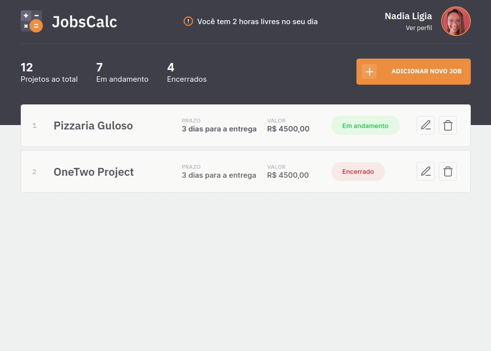

<h1 align="center">
   
  Aula 01
</h1>

<h1 align="center">
  
  
  
</h1>

  <a href="#-information_source-sobre-a-aula">Sobre</a> •
  <a href="#-open_file_folder-conteúdo">Conteúdo</a> • 
  <a href="#-rocket-tecnologias">Tecnologias</a> • 
  <a href="#-woman_office_worker-autora">Autora</a> • 
  <a href="#-pencil-licença">Licença</a>

 

# ℹ️ Sobre a aula

Nesta aula foi realizada a configuranção do ambiente, apresentação do projeto HTML e CSS e as primeiras configurações do servidor e das rotas.

# 📂 Conteúdo

## 📚 Tópicos

* Iniciação do projeto
  * `npm` ou `yarn`

* Instalação das dependências 
  * `express`

* Criação do servidor
  * Iniciação do servidor (`listen`)
  * Primeira rota
      * `.get("/", () ⇒ console.log('cheguei na rota'))`
      * `request` e `response`

* Instalação das dependência de desenvolvimento
  * `nodemon`
  * Configuração de `script` no `package.json` para reload automático do servidor

* Configuração dos diretórios para recebimento das páginas estáticas
  * `views` directory 
  * `public` directory

* Criação do arquivo de rotas
  * `routes.js`
  * Transferência da rota `get` criada anteriormente para o arquivo de rotas
  * Refatoração da rota para que volte a funcionar

* Refatoração das páginas html para corrigir bugs nos links causados pela conexão com o servidor
  * `file paths`
  * `href`

* Instalação e configuração da template engine que será utilizada no projeto
  * `esj`
  * Transformação dos arquivos `.html` em `.ejs`

* Reutilização de componentes (header)
    * `<%- include('parts/page-header', { title: 'Meu Perfil'}) %>`

* Programação no HTML
    * Criação do objeto do perfil de usuário
    * Refatoração do arquivo profile.ejs para recebimento do objeto do perfil do usuário

## 📚 Apresentação

  

## 📚 Mission: Assistir aos cursos

* [NodeJS](https://app.rocketseat.com.br/node/node-js-o-motor-da-nave)
* [NodeJS com EJS]()

 

# 🚀 Tecnologias

Esse projeto foi desenvolvido com as seguintes tecnologias:

- [HTML](https://developer.mozilla.org/pt-BR/docs/Web/HTML)
- [CSS](https://developer.mozilla.org/pt-BR/docs/Web/CSS)
- [JavaScript](https://developer.mozilla.org/pt-BR/docs/Web/JavaScript)
- [NodeJS](https://nodejs.org/en/)
- [EJS](https://ejs.co)
- [Express](https://expressjs.com/)

 

# 👩‍💼 Autora

<b>Nádia Ligia, back-end developer.</b>

&nbsp;
&nbsp;

 

# 📝 Licença

Esse projeto está sob a licença MIT. Veja o arquivo [LICENSE](.github/LICENSE.md) para mais detalhes.

